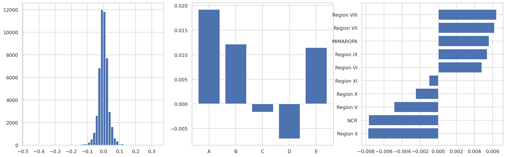
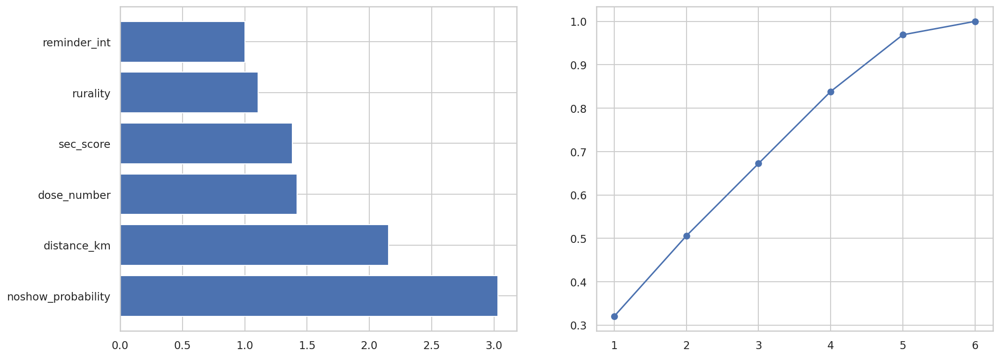

# 🇵🇭 Philippine National Multi-Disease Vaccination Campaign — Synthetic Dataset

### A physics-informed, causally-structured synthetic dataset for public-health analytics
**2024–2028 Longitudinal · 17 Regions · 6 Vaccines · ~1.17M rows · EIF Cohort 10 (Eskwelabs)**


---

## Overview

This repository generates and analyzes a **high-fidelity synthetic dataset** simulating a
national multi-disease vaccination campaign across the Philippines (2024–2028), built for
the Eskwelabs Industry Fellows (EIF) Cohort 10 program.

What sets it apart from a typical synthetic dataset:

- **Eight interdependent mathematical engines** drawn from epidemiology, pharmacology, and logistics — outputs of one engine feed the next.
- **A built-in causal treatment** (`reminder_sent`) with a *known, heterogeneous* effect, so the dataset can teach and validate **causal inference** (ATE / CATE), not just prediction.
- **A full model-validity layer**: stationarity testing, multicollinearity (VIF), dimensionality (PCA), parsimony (L1/Occam), and generator **benchmarking**.

> **Domain:** Public Health / Epidemiology  **Analyst role:** Public Health Analyst
> **Vaccines:** COVID-19 Booster, Influenza, MMR, HPV, Hepatitis B, Rabies PEP
> **Scope:** 17 PH regions, 82 provinces, PSA 2024 population weights

---

## Repository structure

```
philippine-vaccination-campaign-synthetic-dataset/
├── notebooks/
│   ├── 00_project_overview.ipynb     # Math framework, causal design, validity methodology, IEEE refs
│   ├── 01_dataset_cols.ipynb         # Full schema (8 tables) + Mermaid ERD
│   ├── 03_dataset_generator.ipynb    # Synthetic generator (run FIRST)
│   └── 02_eda_notebook.ipynb         # EDA: descriptive → ML → time series → causal (run SECOND)
├── figures/                          # Exported analysis figures
├── requirements.txt
├── LICENSE                           # CC BY-NC 4.0
├── .gitignore
└── README.md
```

> The `data/` folder is **git-ignored** (the full dataset is ~85 MB). Run
> `03_dataset_generator.ipynb` to regenerate all 8 tables locally; changing `RANDOM_SEED`
> produces a statistically equivalent dataset with natural variance.

---

## The eight simulation engines

| Engine | Model | Core equation |
|---|---|---|
| **A. Population** | Poisson demand, PSA-weighted | $N_r \sim \text{Poisson}(\lambda_r)$ |
| **B. No-show (behavioral)** | Logistic + **randomized treatment** | $P=\sigma(\beta^\top x - T(\gamma_0+\gamma_1 b))$ |
| **C. Efficacy waning** | Bi-exponential decay | $E(t)=E_{\text{peak}}[\phi e^{-\lambda_f t}+(1-\phi)e^{-\lambda_s t}]$ |
| **D. Cold chain** | Arrhenius degradation | $P_{\text{ret}}=e^{-k(T)\Delta t},\ k=Ae^{-E_a/RT}$ |
| **E. AEFI** | Age-stratified Poisson (WHO) | $\text{AEFI}\sim\text{Poisson}(\mu_{v,g})$ |
| **F. Herd immunity** | Effective reproduction number | $R_{\text{eff}}=R_0(1-p_{\text{eff}})$ |
| **G. Inventory** | Discrete-time stock balance | $S_{t+1}=S_t+R_t-V_t-W_t$ |
| **H. Seasonal forcing** | Sine + PH health calendar | $A(t)=\bar A[1+\psi\sin(2\pi(t-t_p)/365)]$ |

---

## ⭐ Causal inference: the `reminder_sent` treatment

The appointment reminder is a **randomized treatment** baked into Engine B:

- `reminder_sent` $\sim \text{Bernoulli}(0.65)$, **independent of all covariates** and assigned *before* the outcome → ignorability $Y(0),Y(1)\perp T\mid X$ holds, so **ATE and CATE are identified** without an instrument.
- The effect is **heterogeneous**: a reminder lowers no-show log-odds by $(\gamma_0+\gamma_1\cdot\text{barrier\_score})$, where `barrier_score` $=\text{clip}(0.40\,r+0.30\,s/5+0.30\min(d/20,1),0,1)$. High-barrier (rural, low-SEC, distant) patients benefit most.

The EDA recovers the embedded ground truth three ways and acts on it:

| Method | Result (this build) |
|---|---|
| ATE — inverse probability weighting (IPW) | **+0.125** attendance |
| ATE — doubly-robust (AIPW) | **+0.125** attendance |
| ATE — bootstrap 95% CI | **[+0.118, +0.132]** (significant) |
| CATE — T-Learner, by SEC | **+0.099 (B) → +0.149 (E)** — biggest lift for the hardest-to-reach |
| Optimal policy | Targeting by CATE beats uniform reminder blasts under a fixed SMS budget |

---

## Model-validity layer

Beyond prediction, the EDA validates that the data behaves correctly under the methods an analyst would actually use:

- **Stationarity (ADF + KPSS)** before SARIMA — opposite-null tests run together; campaign phases flagged as regimes (Markov-switching / BSTS noted as the honest long-run alternative).
- **Multicollinearity (VIF)** — $\text{VIF}_j = 1/(1-R_j^2)$ for every predictor; all features land below the severity threshold.
- **Curse of dimensionality (PCA)** — intrinsic-dimensionality scree (components for 90/95% variance).
- **Occam's razor (L1 / LASSO)** — a sparse, auditable logistic model compared against gradient boosting; near-identical AUC justifies the interpretable model for policy use (Rudin, 2019).
- **Inference efficiency** — the generator reports wall-clock time, peak memory, and rows/second; the ~1M-row efficacy-waning table is produced by **NumPy broadcasting**, not a Python loop.

---

## Dataset schema (Medallion architecture)

| Table | Layer | Rows | Cols |
|---|---|---:|---:|
| `dim_sites` | Silver | 150 | 14 |
| `dim_people` | Silver | 5,000 | 20 |
| `fact_appointments` | Silver | 49,186 | 17 |
| `fact_vaccination_events` | Silver | 41,430 | 23 |
| `fact_inventory_shipments` | Silver | 36,139 | 24 |
| `gold_coverage` | Gold | 2,040 | 15 |
| `gold_efficacy_waning` | Gold | 1,001,080 | 9 |
| `gold_cold_chain_risk` | Gold | 36,139 | 9 |
| **Total** | | **1,171,164** | |

`fact_appointments` carries the causal columns: **`reminder_sent`** (treatment) and
**`barrier_score`** (drives the heterogeneous effect). Full column definitions and a
Crow's-Foot Mermaid ERD are in `notebooks/01_dataset_cols.ipynb`.

---

## Sample visualizations

**Regional coverage — 17 regions × 6 vaccines**


**Treatment-effect heterogeneity (CATE) — who benefits most from a reminder**


**Model diagnostics — multicollinearity (VIF) & intrinsic dimensionality (PCA)**


**Bi-exponential efficacy waning per vaccine**


---

## How to run

### Google Colab (recommended)

1. Open `notebooks/03_dataset_generator.ipynb`. Run **Cell 0** (`!pip install -q faker`), then **Runtime → Restart session**.
2. **Runtime → Run all** — generates all 8 tables (~3 min, ~1.17M rows) and prints a generation benchmark.
3. Persist to Drive so notebook 02 can read it from a fresh session:
   ```python
   from google.colab import drive; drive.mount('/content/drive')
   import shutil; shutil.copytree('data', '/content/drive/MyDrive/vaccination_data', dirs_exist_ok=True)
   ```
4. Open `notebooks/02_eda_notebook.ipynb`, set `DATA_ROOT = '/content/drive/MyDrive/vaccination_data'`, uncomment the install cell, **Restart session → Run all**.

Run order: **`03` → `02`**. Notebooks `00` and `01` are documentation and run standalone.

### Local

```bash
git clone https://github.com/cs-loliva/philippine-vaccination-campaign-synthetic-dataset.git
cd philippine-vaccination-campaign-synthetic-dataset
pip install -r requirements.txt
jupyter notebook
```

---

## Challenge statement (for learners)

**L1 — Descriptive:** lowest-coverage regions per vaccine; multi-dose completion by region × SEC.
**L2 — Diagnostic:** statistically significant SEC equity gap? distance from MMR/COVID herd immunity?
**L3 — Predictive, Causal & Prescriptive:** SARIMA 2029 forecast (test stationarity first); **estimate the ATE/CATE of `reminder_sent`**; solve **optimal reminder allocation** under a fixed budget; site-expansion optimization.

---

## Tech stack

Python · NumPy · Pandas · Faker · SciPy · **statsmodels** (SARIMA, ADF/KPSS) ·
**scikit-learn** (logistic, RF, GBM, PCA, propensity/T-Learner) · Matplotlib · Seaborn ·
Medallion architecture · Mermaid ERD · IEEE references.

---

## References

All parameters are grounded in peer-reviewed literature and official guidance; full
IEEE-format citations (34 sources, including causal inference — Rubin, Pearl, Imbens &
Rubin, Künzel et al.; stationarity — Dickey-Fuller, KPSS, Hamilton; and interpretability —
Rudin, Belsley et al.) are in `notebooks/00_project_overview.ipynb`.

---

## Copyright & License

**Copyright © 2026 — Lenard Amiel Oliva. All rights reserved.**

Licensed under the **Creative Commons Attribution-NonCommercial 4.0 International License
(CC BY-NC 4.0)**. You may share and adapt the material with attribution, for
non-commercial purposes. See [`LICENSE`](LICENSE).

[](https://creativecommons.org/licenses/by-nc/4.0/)

> No real patient data is used or represented. The synthetic dataset is suitable for
> education and research under the terms above.
