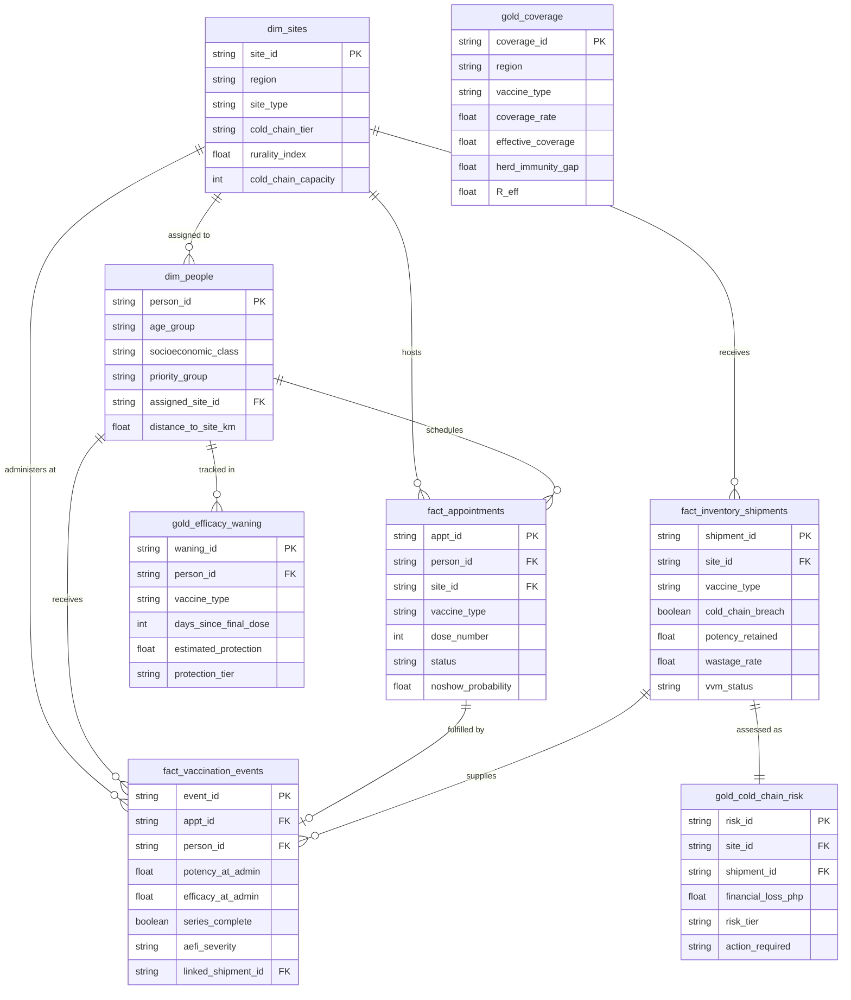
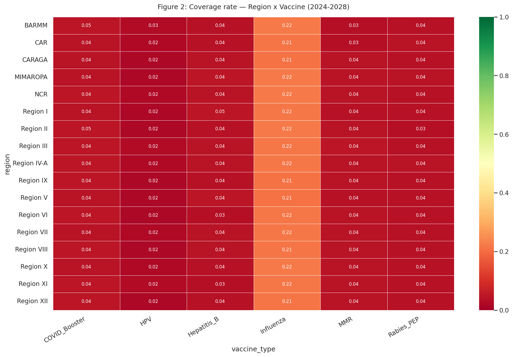
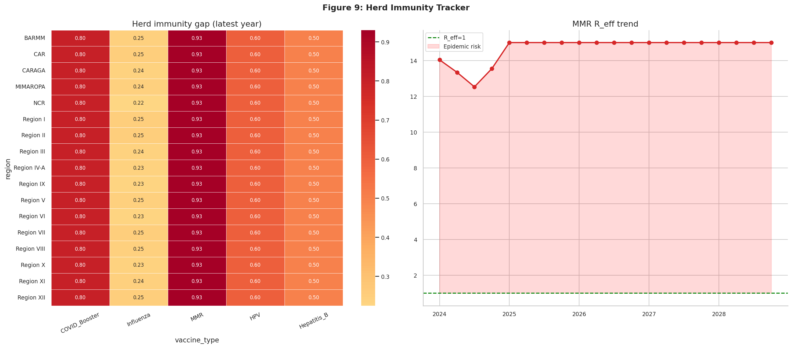
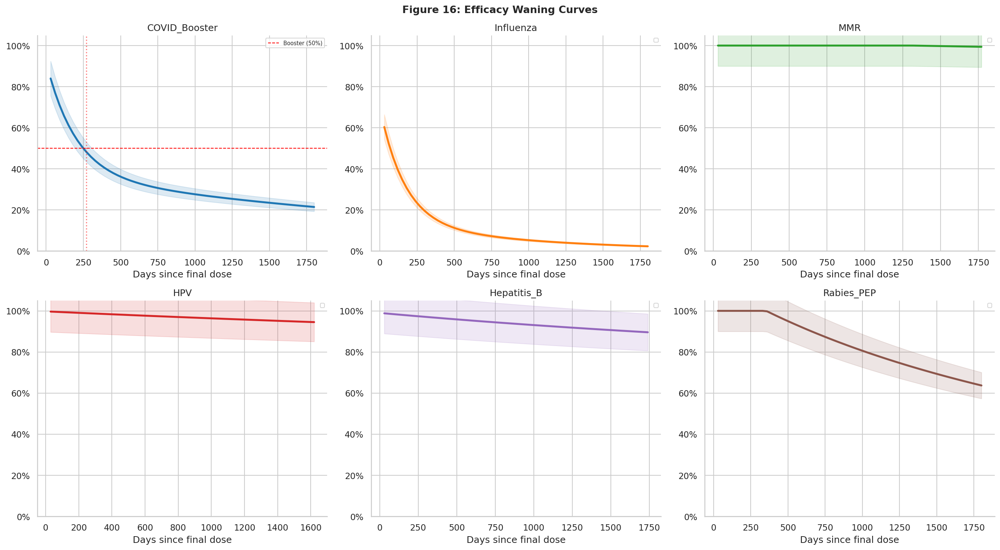
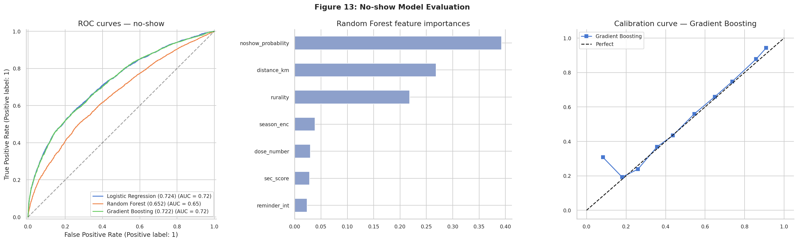

# philippine-vaccination-campaign-synthetic-dataset
Physics-informed synthetic public health dataset simulating 800K+ vaccination records across 17 PH regions. Features bi-exponential efficacy waning, Arrhenius cold chain modeling, and logistic no-show prediction. Python · Pandas · Scikit-learn.

# 🇵🇭 Philippine National Multi-Disease Vaccination Campaign
### Synthetic Dataset Generator & Analytical Framework
#### 2024–2028 Longitudinal | EIF Cohort 10 — Eskwelabs


---

## Overview

This project generates a **high-fidelity synthetic dataset** simulating a national multi-disease vaccination campaign across the Philippines from 2024 to 2028. It was developed as part of the Eskwelabs Industry Fellows (EIF) Cohort 10 program.

The dataset is grounded in **eight interdependent mathematical models** drawn from epidemiology, pharmacology, and public health logistics — making it suitable for use in learning challenges, data analytics training, dashboard development, and machine learning research.

> **Domain:** Public Health / Epidemiology  
> **Target analyst role:** Public Health Data Analyst  
> **Dataset size:** ~800,000+ rows across 8 tables  
> **Vaccines modeled:** COVID-19 Booster, Influenza, MMR, HPV, Hepatitis B, Rabies PEP  
> **Geographic scope:** 17 Philippine regions, 82 provinces (PSA 2024 population weights)

---

## Repository Structure

```
philippine-vaccination-campaign/
│
├── notebooks/
│   ├── 00_project_overview.ipynb       # Mathematical framework & challenge statement
│   ├── 01_dataset_cols.ipynb           # Full schema definitions with Mermaid ERD
│   ├── 03_dataset_generator.ipynb      # Synthetic data generator (run this first)
│   └── 02_eda_notebook.ipynb           # Exploratory data analysis (run this second)
│
├── figures/                            # All EDA output visualizations (15 figures)
├── requirements.txt                    # Python dependencies
├── .gitignore
└── README.md
```

> **Note:** The `data/` folder is excluded from this repository (see `.gitignore`).  
> Run `03_dataset_generator.ipynb` to regenerate the full dataset locally.  
> Changing `RANDOM_SEED` produces a statistically equivalent but numerically different dataset — mimicking natural variance.

---

## Mathematical Model Architecture

The generator is built on **eight interdependent simulation engines**. Outputs from one engine feed as inputs to another, replicating how real-world public health variables co-determine each other.

| Engine | Model | Key Equation |
|---|---|---|
| A. Population | Poisson demand model | $N_r \sim \text{Poisson}(\lambda_r)$, weighted by PSA 2024 regional population |
| B. Behavioral | Logistic no-show model | $P(\text{no-show}) = \sigma(\beta_0 + \beta_1 d + \beta_2 s + \beta_3 \delta + \beta_4 h + \beta_5 r)$ |
| C. Immunological | Bi-exponential waning | $E(t) = E_\text{peak}[\phi e^{-\lambda_f t} + (1-\phi)e^{-\lambda_s t}]$ |
| D. Cold Chain | Arrhenius degradation | $P_\text{retained} = e^{-k(T) \cdot \Delta t}$, $k(T) = Ae^{-E_a/RT}$ |
| E. Pharmacovigilance | Age-stratified AEFI | $\text{AEFI} \sim \text{Poisson}(\mu_{v,g})$ per WHO guidelines |
| F. Epidemiological | Herd immunity threshold | $R_\text{eff} = R_0(1 - p_\text{eff})$, $p_\text{HIT} = 1 - 1/R_0$ |
| G. Logistics | Inventory balance | $S_{t+1} = S_t + R_t - V_t - W_t$ |
| H. Seasonal | PH calendar forcing | $A(t) = \bar{A}[1 + \psi \sin(2\pi(t - t_\text{peak})/365)]$ |

---

## Dataset Schema

The dataset follows a **Medallion Architecture** with Silver (observable) and Gold (derived) layers.



| Table | Layer | Rows | Columns |
|---|---|---|---|
| `dim_sites` | Silver | ~150 | 14 |
| `dim_people` | Silver | ~5,000 | 17 |
| `fact_appointments` | Silver | ~49,000 | 16 |
| `fact_vaccination_events` | Silver | ~27,000 | 23 |
| `fact_inventory_shipments` | Silver | ~36,000 | 24 |
| `gold_coverage` | Gold | ~2,040 | 15 |
| `gold_efficacy_waning` | Gold | ~642,000 | 9 |
| `gold_cold_chain_risk` | Gold | ~36,000 | 9 |
| **Total** | | **~800,000+** | **127** |

---

## Sample Visualizations

**Regional coverage heatmap — all 17 PH regions × 6 vaccines**


**Herd immunity gap tracker & MMR R_eff trend**


**Bi-exponential vaccine efficacy waning curves**


**No-show prediction model — ROC curves, feature importance, calibration**


---

## How to Run

### Option A — Google Colab (recommended)

1. Open `notebooks/03_dataset_generator.ipynb` in Colab
2. Run **Cell 0** only (`!pip install -q faker`) → **Runtime → Restart session**
3. **Runtime → Run all** — generates all 8 CSV tables (~800K rows)
4. Save data to Google Drive:
   ```python
   from google.colab import drive
   drive.mount('/content/drive')
   import shutil
   shutil.copytree('data', '/content/drive/MyDrive/vaccination_data', dirs_exist_ok=True)
   ```
5. Open `notebooks/02_eda_notebook.ipynb` in a new Colab tab
6. Set `DATA_ROOT = '/content/drive/MyDrive/vaccination_data'`
7. Uncomment the pip install cell → **Runtime → Restart session → Run all**

### Option B — Local environment

```bash
git clone https://github.com/<your-username>/philippine-vaccination-campaign.git
cd philippine-vaccination-campaign
pip install -r requirements.txt
jupyter notebook
```

Run notebooks in this order: `03` → `02` (notebooks `00` and `01` are documentation only).

---

## Challenge Statement

The Philippine Department of Health (DOH) is reviewing the 2024–2028 National Immunization Program to identify gaps in vaccine coverage, cold chain integrity, and equity of access.

**Level 1 — Descriptive Analytics**
- Which regions have the lowest vaccination coverage per vaccine type?
- What is the dose completion rate for multi-dose vaccines by region and socioeconomic class?

**Level 2 — Diagnostic Analytics**
- Is there a statistically significant equity gap between SEC A/B and D/E beneficiaries?
- Which regions are furthest from herd immunity for measles (MMR) and COVID-19?

**Level 3 — Predictive & Prescriptive Analytics**
- Forecast 2029 vaccination volumes using time series methods (SARIMA / Prophet)
- Given a fixed budget, which provinces should receive new facilities to maximize coverage gain?

---

## Tech Stack

- **Data generation:** Python, NumPy, Pandas, Faker
- **Statistical modeling:** SciPy, Statsmodels
- **Machine learning:** Scikit-learn (Logistic Regression, Random Forest, Gradient Boosting)
- **Visualization:** Matplotlib, Seaborn
- **Architecture:** Medallion Architecture (Silver / Gold layers)
- **Documentation:** Jupyter Notebooks, Mermaid ERD, IEEE citation format

---

## References

All mathematical parameters are grounded in peer-reviewed literature and official guidelines. Full IEEE-format references are included in `00_project_overview.ipynb`. Key sources:

- Philippine Statistics Authority, *2024 Population Projections by Region*, PSA Manila, 2024
- World Health Organization, *Immunological Basis for Immunization Series*, WHO/IVB/18.10, 2018
- N. Andrews *et al.*, "Duration of Protection against COVID-19," *NEJM*, vol. 386, 2022
- Department of Health Philippines, *National Immunization Program Coverage Survey 2023*
- S. B. Hanson *et al.*, "Arrhenius Modeling of Vaccine Thermal Stability," *Vaccine*, vol. 37, 2019

---

## About

Developed as part of the **Eskwelabs Industry Fellows (EIF) Cohort 10** program.  
Domain expertise in pharmaceutical sciences and medical research applied to public health data modeling.

---

## Copyright & License

Copyright © 2026 - Lenard Amiel Oliva. All rights reserved.

The notebooks, mathematical models, schema designs, and written documentation in this repository are the original work of the author, developed during the Eskwelabs EIF Cohort 10 program.

This work is licensed under the **Creative Commons Attribution-NonCommercial 4.0 International License (CC BY-NC 4.0)**.

You are free to:
- **Share** — copy and redistribute the material in any medium or format
- **Adapt** — remix, transform, and build upon the material

Under the following terms:
- **Attribution** — You must give appropriate credit, provide a link to the license, and indicate if changes were made
- **NonCommercial** — You may not use the material for commercial purposes without explicit written permission from the author

[](https://creativecommons.org/licenses/by-nc/4.0/)

> The synthetic dataset produced by running this generator is not confidential and may be freely used for educational and research purposes per the terms above.  
> Real patient data is not used or represented anywhere in this project.
